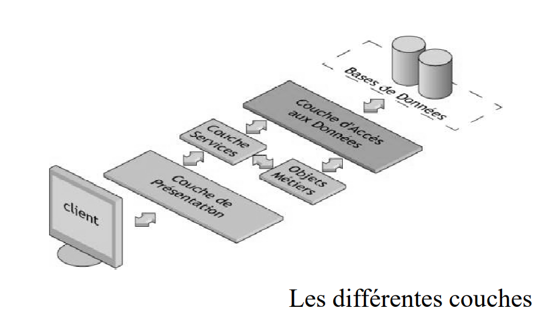

# Projet TP SIR en M1 Miage 2019

Le but de cette application est de developper une pplication du même type que l'application web Doodle.

Le projet à été developpé suivant les principes d'une application avec architecture REST.

Il nous est demandé de construire le projet sur la base d'une architechture 3-tiers où on pourra explicitement 
distinguer :
* Une couched'accès aux données qu'on nomera par la suite couche DAO
* Une couche métiers 
* Une couche de services
* Une couche de présentation (parti front de l'application qui sera developper en Angular et qui se greffera à la partie back-end dont il est question dans ce rendu)

Ci-dessous une illustattion schematique de l'architechture du projet

Dans le repertoire source du projet, nous avons:

* Un package **jpa** où figure un ensemble de classe java qui représente le classe métier du projet.
Ces classes métiers naissent de la modelisation UML faite en fonction des règles de gestion ou use case fourni au demarrage du projet
Exemple de classe métier du projet : 
    * Reunion
    * Personne
    * Lieu
    * ElementSondage

* Un package **dao** où figure les classes d'accès aux données. Pour l'ensemble des classe de la couche dao nous nous somme servi 
de la classe java EntityManagerHelper fourni par Olivier Barais ayant permis à chaque fois de faciliter les interactions sur la base de données (Selections,Insertions, mises à jour, Suppression)

* Un package **fr.istic.sir.rest** où figure les classes de service REST 
* Le backend est disponible sur la branche : brancheMax
